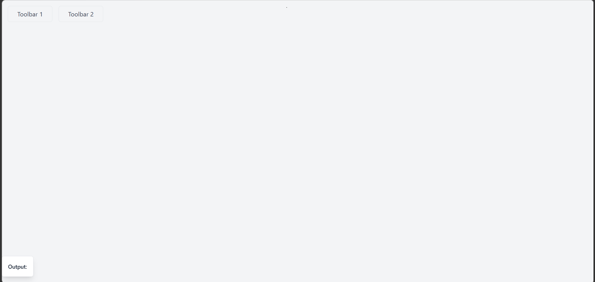
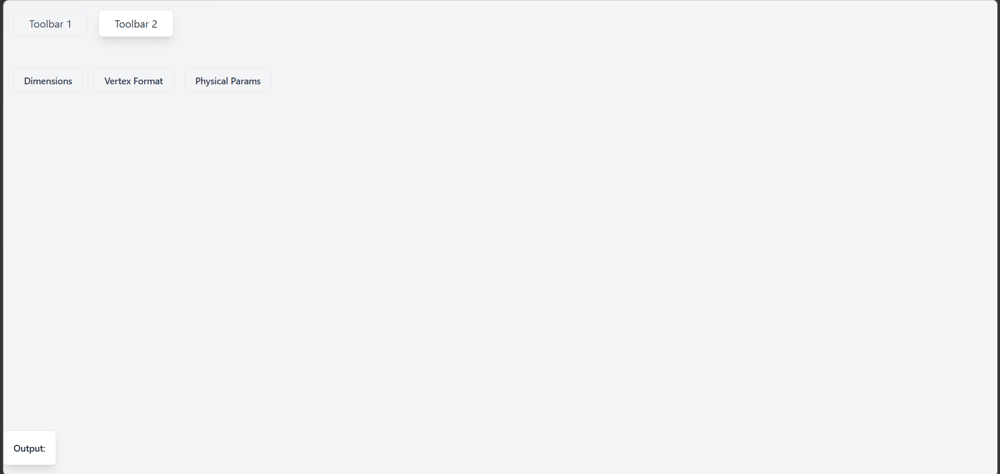
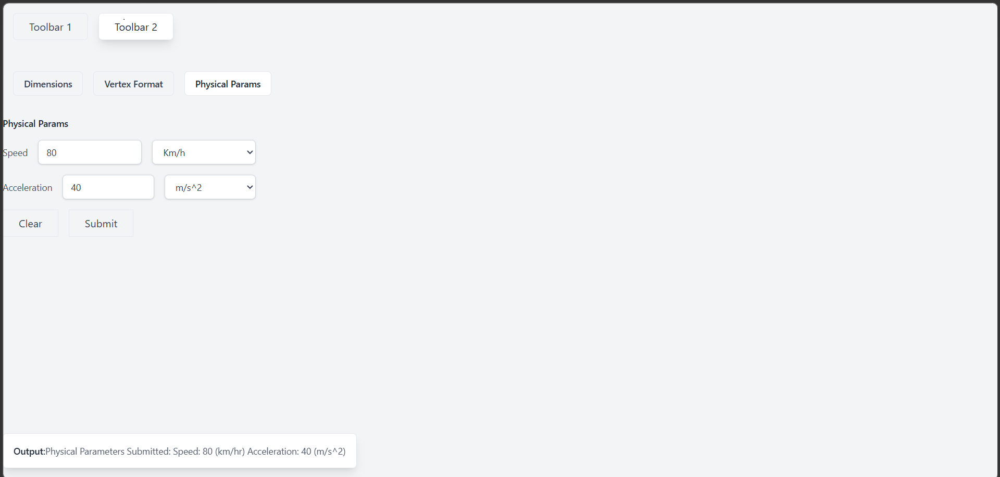

### This project is an attempt to build a full-stack web app with an interactive web GUI.

- Starting with the Client, which is a simple web GUI built using TS.
  - The Client follows a simple MVC pattern.
  - The display is split into multiple levels similar to typical applications like Blender, FreeCAD etc.
  - A top level Workspace contains the various toolbars.

  - A second level Toolbar contians the various buttons.

  - The buttons themselves are a mix of various input elements to allow complex inputs.

  - The MVC pattern enables the buttons to interact with each other via an observer pattern.

- The Server is built using Express.js and follow a simple design. The Server will use gRPC to communcate with other processes on it's host.

1. merge the server_branch with the master branch. --- me
2. Workdir is the folder which should always exists
  a. Each user must see a tree-view of everything underneath the workdir folder
3. After the user creates the simulation he should see the input.json in the tree-view
4. After solution end the user must see the out files in the tree-view.

|-Lbm
| - Solver1
  | - input.json
  | - solution.json
  - Solver2
   
5. Deletion of resources (memory of workdir/Lbm/1 etc.) is important. Thus, when a delete of the solver is requested, these resources must be freed up.

6. Since most server operation are asynchronous, there must be a way for the client to find the state of the async operations. This is needed to update the tree-view as well as to monitor the 
operations (in case of crash). This can be done by a polling mechanism where the client will repeatedly poll the server to query the status of active programs. ---

git checkout -b branch_muziba origin/master
git checkout -b branch_jacob origin/master

Bugs: In server/lbSolver there is a duplication of "input.json" name.